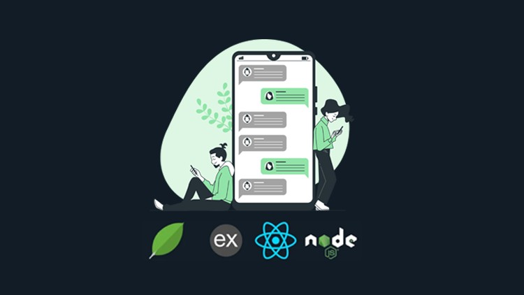
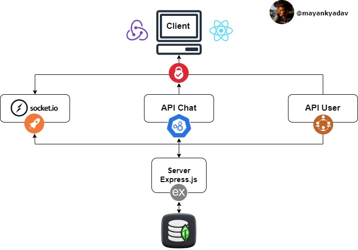

# Chat Application - MERN Stack

## Table of contents

* [Chat Application - MERN Stack](./)
* [Features](features.md)
* [Architecture](architecture.md)
* [Screenshots](screenshots.md)
* [Codebase](codebase.md)

## Chat Application - MERN Stack

<figure><figcaption><p>Chat Application - MERN Stack</p></figcaption></figure>

This Chat Application is a web-based platform designed to facilitate real-time communication between users. It allows users to create accounts, join chat rooms, send messages, real time file transfer, and interact with other users in a seamless and intuitive manner. This document provides an overview of the application's features, architecture, and usage instructions.


## Features

<figure><figcaption><p>Features</p></figcaption></figure>

1. **User Authentication:** Users can create accounts and log in securely to access the chat features.
2. **Chat Rooms (Groups):** Users can create new chat rooms or join existing ones to engage in group conversations.
3. **Real-time Messaging:** The application provides instant messaging capabilities, allowing users to send and receive messages in real-time.
4. **File Attachments:** Users can share files, images, and other media types within chat rooms.
5. **Friend Requests:** Users can send and accept friend requests to establish connections with other users.
6. **Notifications:** The application notifies users about new messages, friend requests, and other relevant activities.
7. **Profile Management:** Users can update their profile information, including name, avatar, and status.
8. **Admin Dashboard:** Admin users have access to a dashboard where they can view analytics, manage users, monitor chat activity.
9. **Infinite Scrolling**: The chat messages feature infinite scrolling, allowing users to load older messages as they scroll up in the chat window.
10. **Group Management**: Group Admin can manage the group activities and performs all the CRUD operation related to the Group.

## Architecture

<figure><figcaption><p>Architecture Diagram</p></figcaption></figure>

The system architecture of the Chat Application consists of several components working together to provide the desired functionality.

1. **Client**:
   * **React JS**: The front-end framework used for building the user interface of the chat application. React provides a component-based architecture for creating interactive UI elements.
   * **Redux**: A predictable state container for managing the application's state. Redux helps in managing complex state logic and enables data flow throughout the application.
2. **Authentication**:
   * **API (Authentication)**: This component is responsible for handling authentication-related requests, such as user registration, login, logout, and session management. It ensures that users can securely authenticate themselves before accessing chat features.
3. **Socket.io**:
   * **Real-time Communication**: Socket.io facilitates real-time bidirectional communication between the client and server. It enables instant messaging functionality, allowing users to send and receive messages in real-time.
4. **API (Chat)**:
   * **Chat Operations**: This component manages chat-related operations, such as creating new chat rooms, sending messages, fetching chat history, and managing group activities. It handles requests related to chat functionalities and communicates with the database to retrieve or store chat data.
5. **API (User)**:
   * **User Management**: This component deals with user-related operations, such as user profile management, friend requests, user search, and other user-specific functionalities. It handles requests related to user management and interacts with the database to retrieve or update user information.
6. **Server**:
   * **Express JS**: The server-side framework used for building the back-end logic of the chat application. Express provides a robust set of features for handling HTTP requests, defining routes, and implementing business logic.
7. **Database**:
   * **MongoDB**: A NoSQL database used for storing and managing the application's data. MongoDB provides a flexible schema structure, making it suitable for storing chat messages, user profiles, group information, and other related data.

## Screenshots

### Login

<figure><figcaption></figcaption></figure>

### Sign Up

<figure><figcaption></figcaption></figure>

### Home Screen

<figure><figcaption></figcaption></figure>

### Chat Screen

<figure><figcaption></figcaption></figure>

### Create Group

<figure><figcaption></figcaption></figure>

### Manage Groups

<figure><figcaption></figcaption></figure>

### Admin Dashboard

<figure><figcaption></figcaption></figure>

<figure><figcaption></figcaption></figure>

<figure><figcaption></figcaption></figure>

<figure><figcaption></figcaption></figure>

### 404 - Not Found

<figure><figcaption></figcaption></figure>

## Codebase

Github : [https://github.com/mayankyadav1711/MySocket.git](https://github.com/mayankyadav1711/MySocket.git)\
\
Here are the installation commands for setting up the chat application:

**Server Installation:**

1.  Change directory to the server folder:

    ```bash
    cd server
    ```
2.  Install server dependencies:

    ```bash
    npm install
    ```
3.  Set up environment variables by creating a `.env` file in the server directory and adding the following variables:

    ```bash
    MONGO_URI=your_mongodb_uri
    JWT_SECRET=your_jwt_secret
    ADMIN_SECRET_KEY=your_admin_secret_key
    NODE_ENV=development
    CLIENT_URL=http://localhost:3000
    CLOUDINARY_CLOUD_NAME=your_cloudinary_cloud_name
    CLOUDINARY_API_KEY=your_cloudinary_api_key
    CLOUDINARY_API_SECRET=your_cloudinary_api_secret
    ```
4.  Start the server in development mode:

    ```bash
    npm run dev
    ```

**Client Installation:**

1.  Change directory to the client folder:

    ```bash
    cd client
    ```
2.  Install client dependencies:

    ```bash
    npm install
    ```
3.  Set up environment variables by creating a `.env` file in the client directory and adding the following variable:

    ```arduino
    VITE_SERVER=http://localhost:3000
    ```
4.  Start the client application in development mode:

    ```bash
    npm run dev
    ```
