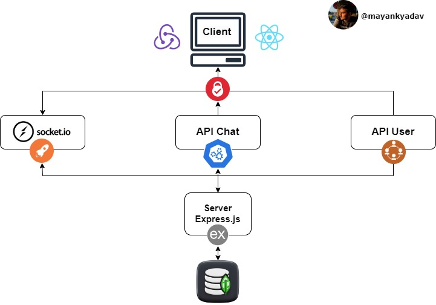

# Architecture

<figure><figcaption>
Architecture Diagram
</figcaption></figure>

The system architecture of the Chat Application consists of several components working together to provide the desired functionality.

1.
   1. **Client**:
      * **React JS**: The front-end framework used for building the user interface of the chat application. React provides a component-based architecture for creating interactive UI elements.
      * **Redux**: A predictable state container for managing the application's state. Redux helps in managing complex state logic and enables data flow throughout the application.
   2. **Authentication**:
      * **API (Authentication)**: This component is responsible for handling authentication-related requests, such as user registration, login, logout, and session management. It ensures that users can securely authenticate themselves before accessing chat features.
   3. **Socket.io**:
      * **Real-time Communication**: Socket.io facilitates real-time bidirectional communication between the client and server. It enables instant messaging functionality, allowing users to send and receive messages in real-time.
   4. **API (Chat)**:
      * **Chat Operations**: This component manages chat-related operations, such as creating new chat rooms, sending messages, fetching chat history, and managing group activities. It handles requests related to chat functionalities and communicates with the database to retrieve or store chat data.
   5. **API (User)**:
      * **User Management**: This component deals with user-related operations, such as user profile management, friend requests, user search, and other user-specific functionalities. It handles requests related to user management and interacts with the database to retrieve or update user information.
   6. **Server**:
      * **Express JS**: The server-side framework used for building the back-end logic of the chat application. Express provides a robust set of features for handling HTTP requests, defining routes, and implementing business logic.
   7. **Database**:
      * **MongoDB**: A NoSQL database used for storing and managing the application's data. MongoDB provides a flexible schema structure, making it suitable for storing chat messages, user profiles, group information, and other related data.
